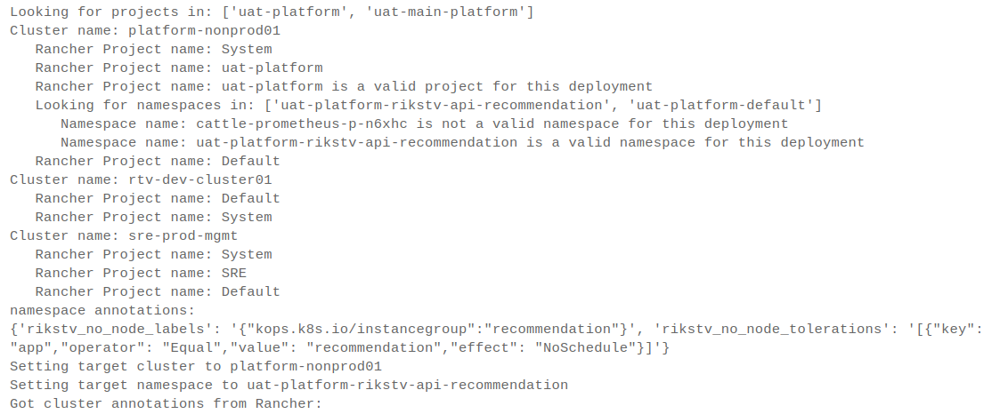

Weird how time flies - we've actually been running Kubernetes in production for over 2 years already. Until now, we've used an Ansible-based provisioning approach written by yours truly (<https://github.com/trondhindenes/Kubelini>). This has served us well enough, but it has also required some maintenance effort so we were looking to simplify and standardize. This post is about that.

## Cluster provisioning tooling
We basically set out to evaluate two options: kops and AWS EKS. While both have pros and cons, we landed on kops, since EKS still would have required us to manage the workers ourselves. Kops allows us to do full lifetime management (create/modify/destroy) of clusters using a fairly easy to use cli tool, and that's just how we like it. 
That's not to say kops is perfect tho, it definetely has its quirks. But those are quirks we can live with.

## From static to dynamic clusters
Until now we've had one cluster per env, and scaled as needed. Adding capacity has been a manual process - change autoscaling group capacity and wait a few minutes.

We wanted to see if we could build a more dynamic setup with multiple clusters per environments (or clusters spanning multiple environments if we wanted). The largest obstacle here is related to code deploys. How does `<insert deploy tool here>` know which cluster to deploy a certain app to?

Multiple clusters also presents a challenge in allowing developers to get to the correct cluster if they want to do stuff. Until now we've been running Kubernetes-Dashboard, and each env has a unique dashboard url.

So, to combat this we're registering all clusters with Rancher <https://rancher.com/products/rancher/> (We run Rancher in a separate "management cluster"). Rancher has the concept of "projects", which essentially sits between the cluster level and the namespace level. A cluster can contain multiple projects, and a project can contain multiple Kubernetes namespaces.

## Deploying code
Rancher also allows us to store metadata about the cluster in the form of "cluster annotations". Since we're using AWS ALBs with Ingress, we store the cluster ALB DNS name using annotations, so that the deploy process can read the correct DNS CNAMEs, which allows us to auto-provision DNS records in Route53 - a very popular feature with dev teams. We also use cluster annotations to store a list of allowed dns names for the cluster.

We use a custom deployment tool at RiksTV, which is (for now) executed using Octopus Deploy. Since the deployment tool is completely containerized it can run anywhere tho, and we might move off of Octopus at some point but for now it's working well enough.

We've added Rancher integration to our deployment lib, so the deploy process now looks like this:
1. Dev team deploys version `2.0.0` of app `xyz` to env `dev`
2. ContainerDeploy kicks off and validates all input params
3. ContainerDeploy talks to Rancher to get a list of Rancher Projects in all clusters matching the owning team and environment for the app being deployed
4. For matching projects, find the correct namespace (we have a strict naming structure for namespaces)
5. When the correct namespace is identified, get annotations from the target cluster and namespace (at this point we know how to wire up DNS, etc). The chosen namespace might also contain settings which will be written back onto the Kubernetes Deployment object, such as taints/tolerations. This allows us to link a namespace to an instance group in a very simple manner
6. Do the deploy, wait for rolling update
7. If needed, update DNS in Route53

Here's some of the output from the "Rancher part" of the deployment process:

I'll probably write more about our deployment tooling later, but these are the general steps, and it works really well.

## Cluster addons
Provisioning a cluster is a matter of following this process:
1. Create cluster "vars file" (we have a repo where all cluster configs are stored)
2. Generate/Execute cloudformation for cluster. This sets up ALBs, some special IAM roles and similar
3. Generate kops config for cluster. This step essentially templates the vars file against a predefined "kops template" and spits out a finished kops config. We use Ansible for all of this
4. Create cluster from config
5. Execute "addons" Ansible playbook. We have a number of Ansible roles where different cluster "addons" are applied. Again we're just using Ansible to template kubernetes manifest files and apply them. This is where things like Traefik, Jaeger agent, cluster-autoscaler, monitoring agents and Rancher registration is performed.

We're huge fans of using Ansible for stuff like this - it allows maintaining a very simple "vars" file which serves as input for all the "system pods" we apply to clusters, and creating a new "addon role" is super-simple.

One "addon" worth mentioning in particular is the `KubernetesJanitor`, which is a RiksTV-specific thing. Janitor does a bunch of things, among others determines which AWS ALBs point at the cluster, and updates cluster annotations in Rancher accordingly. 

All in all, the only variable that's absolutely required for spinning up a cluster is the cluster name, and the AWS Account to run it in. Everything else has sane defaults, and allows us to spin up a cluster ready to deploy real apps in about 15 minutes (most of which is spent waiting for Cloudformation and ec2 instances). Cluster annotations are written within a minute or two after the "addons" playbook has been executed and all that's needed to deploy code is creating the necessary Rancher project and namespaces which the deploy tool needs.

## Autoscaling
Since we run cluster-autoscaling, the various instance groups in the cluster are adjusted to the required size. This is still new stuff for us, but it seems to be working really well. We're also starting to use "Horizontal Pod Autoscaler" objects in our apps, which fits together with cluster-autoscaler very nicely and gives us a very dynamic environment.

## Summing up
I'm super-pleased with this new setup. It feels like we're cranking Kubernetes to 11, and in the process we can delete a (metric) ton of custom provisioning code. We'll still keep an eye on EKS but for now, kops seems to work very well and Rancher gives a nice and easy to use UI and API for us to keep our clusters organized and dev teams happy.

